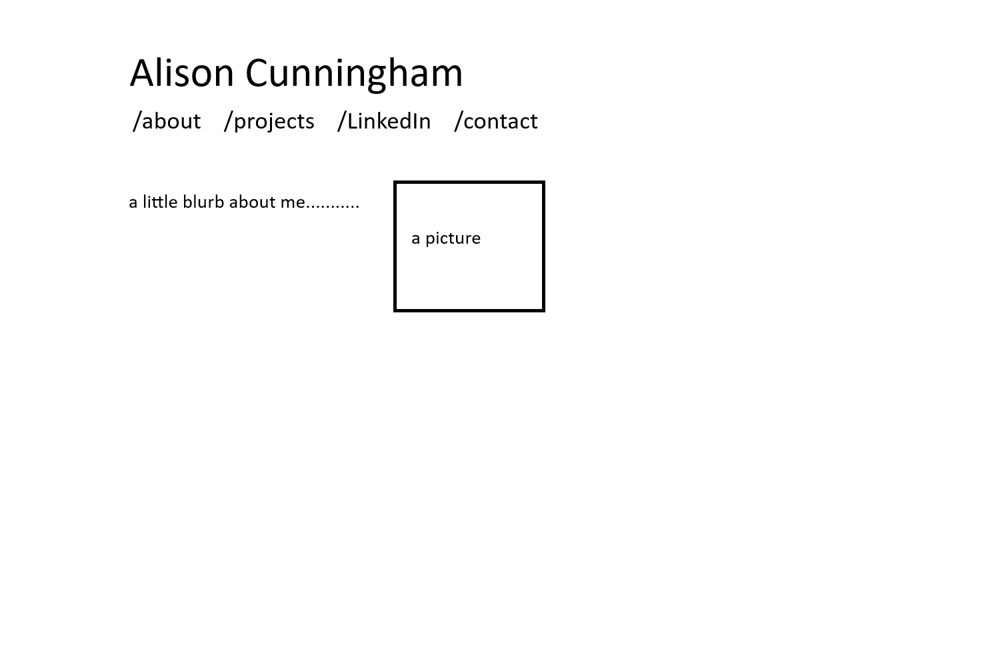

# Feature: Home Page
## Goal
implement `index.html`
## Designs

## Work
- Simple UI, very streamlined and easy to navigate
- A navigation bar at the top: my name as the title and links to home(about), projects, LinkedIn, and contact info
- a `
` element to contain info about me, and an `` element
- hover on the nav bar changes the colour of the selected text
## Deliverables
- Done looks like:
  - functional navigation bar
  - scalable and responsive design
  - all correct and comprehensive information