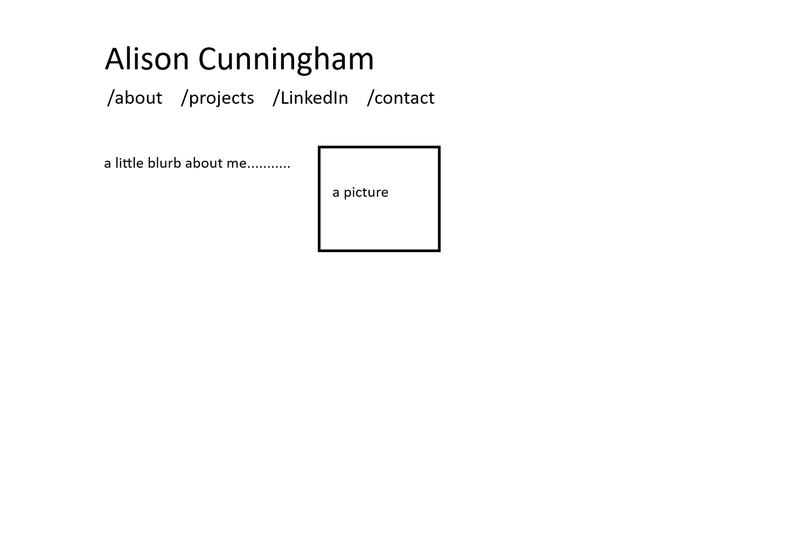

# Feature: Home Page
## Goal
implement `index.html`
## Designs

## Work
- Simple UI, very streamlined and easy to navigate
- A navigation bar at the top: my name as the title and links to home(about), projects, LinkedIn, and contact info
- a `
` element to contain info about me, and an `` element
- hover on the nav bar changes the colour of the selected text
## Deliverables
- Done looks like:
  - functional navigation bar
  - scalable and responsive design
  - all correct and comprehensive information

## Updates
- implemented responsive design
  - included a scroll bar at the top in mobile
  - changed the layout to place divs side by side on larger screens

### Responsiveness
✓ Mobile styling is the default, but the only other view supported is large screens. 
✗ No specific tablet view is available

### Styling Best Practices
✓ globals.css contains fonts and `<body>` styling
✓ index.css contains styling specific to the contents of the home page
✗ only 1 font is available in globals.css, no fallbacks
✓ no inline css
✗ some `px` used: with `box-shadow` in `.about-me` and with `max-width` in main tag in `index.css`

### HTML Best Practices
✓ semantic elements are used appropriately
✓ divs are minimal and purposeful
✓ uses relative paths
✓ images include `alt` text

### General Best Practices
✓ no dead code, unused classes, or commented blocks
✓ resolves all `TODO` comments
✗ no comments in code

### Performance Optimization
✗ no srcset images
✗ no compressed images