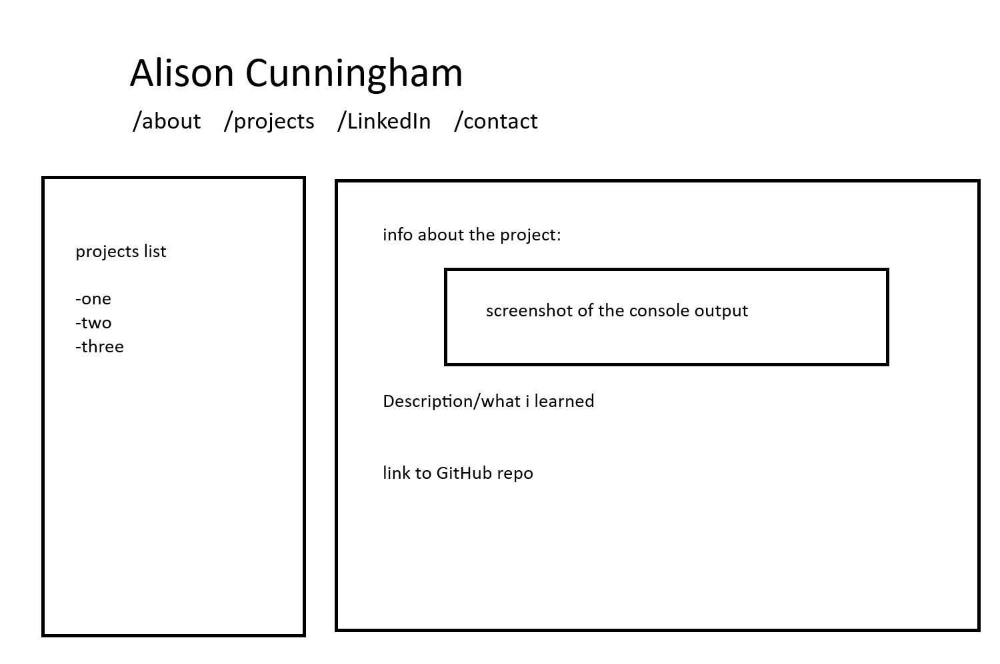

# Feature: Projects
## Goal
implement `projects.html`
## Designs

## Work
- Similar aesthetic design to the home page
- will have a sidebar with a list of projects that can be toggled
- a screenshot and a short description of each project shown
## Deliverables
- Done looks like:
  - a functional sidebar
  - completed information about each project
